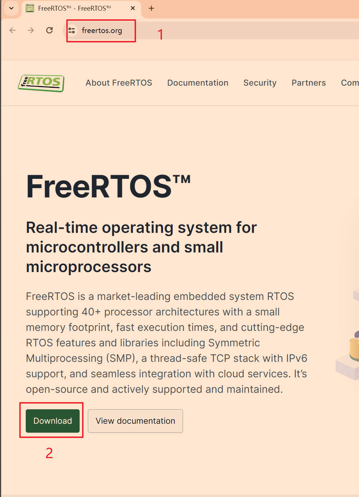
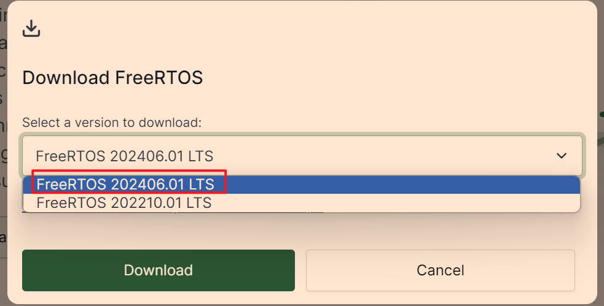
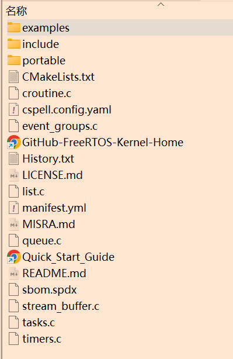
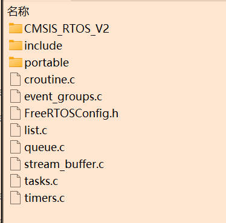
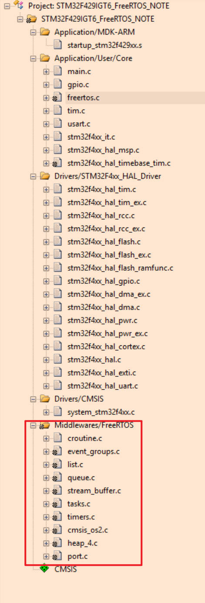
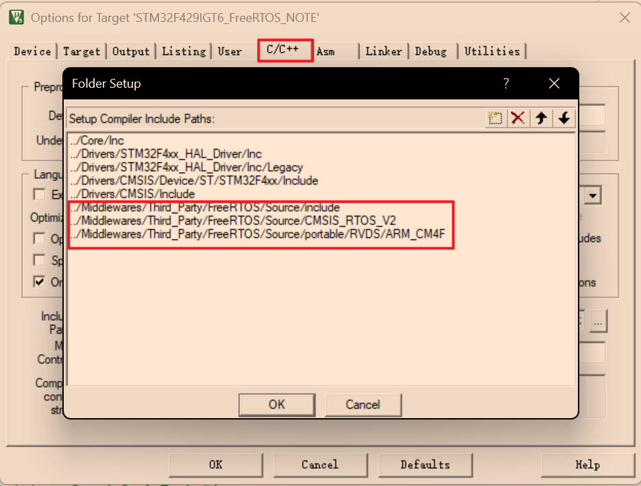
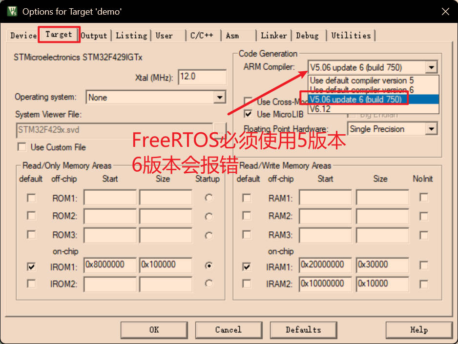

# 说明 

FreeRTOS学习笔记 


# 搭建STM32F1开发环境 

- arm-none-eabi-gcc 下载：https://developer.arm.com/tools-and-software/open-source-software/developer-tools/gnu-toolchain/gnu-rm/downloads 
- GitHub上ST官方库：https://github.com/STMicroelectronics/STM32CubeF1

由于`github`仓库使用`git submodule`命令创建的，不能直接下载`zip`压缩包，需要使用`git`指令下载：

```shell
git clone --recursive https://github.com/STMicroelectronics/STM32CubeF1.git
git pull
git submodule update --init --recursive
```


# keil5搭建STM32F4HAL库开发环境 


- GitHub上ST官方库：https://github.com/STMicroelectronics/STM32CubeF4

由于`github`仓库使用`git submodule`命令创建的，不能直接下载`zip`压缩包，需要使用`git`指令下载：

```shell
git clone --recursive https://github.com/STMicroelectronics/STM32CubeF4.git
git pull
git submodule update --init --recursive
```

硬件开发环境：

- 正点原子`STM32F429IGT6`开发板
- `keil5` 

`STM32F429IGT6`系列`MCU`：

- 内核：ARM Cortex-M4
- 架构：ARMv7-M
- 支持：Thumb-2指令集、单精度FPU，DSP指令
- Flash：1M
- RAM：256K（192K+64K CCM）

创建文件夹

- cminc：存放`STM32CubeF4\Drivers\CMSIS\Include` 路劲下的头文件，只需要4个头文件：`cmsis_armclang.h`，`cmsis_compiler.h`，`cmsis_version.h`，`core_cm4.h`，`mpu_armv7.h`，`cmsis_armcc.h`

    

  

​	注意`keil5`中使用**版本5**编译器会调用`cmsis_armcc.h` 头文件，使用**版本6**编译器会调用`cmsis_armclang.h`头文件，所以最好两个文件都包含

 

- halsrc：存放`STM32CubeF4\Drivers\STM32F4xx_HAL_Driver\Src` 下面的库文件
- halinc：存放`STM32CubeF4\Drivers\STM32F4xx_HAL_Driver\Inc` 下面的头文件
- cmsrc：存放`STM32CubeF4\Drivers\CMSIS\Device\ST\STM32F4xx\Source\Templates\` 路径下的`system_stm32f4xx.c` 文件
- startup：存放`STM32CubeF4\Drivers\CMSIS\Device\ST\STM32F4xx\Source\Templates\arm` 下面的启动文件，选择`startup_stm32f429xx.s` 启动文件

- config：

  - 存放 `STM32CubeF4\Drivers\CMSIS\Device\ST\STM32F4xx\Include\` 路径下的`system_stm32f4xx.h` ，`stm32f4xx.h` ，`stm32f429xx.h` 文件。
  - 存放`STM32CubeF4\Projects\STM32F429I-Discovery\Templates\Inc\` 路径下的`stm32f4xx_hal_conf.h`，`stm32f4xx_it.h` ，`main.h`文件

- user：存放`STM32CubeF4\Projects\STM32F429I-Discovery\Templates\Src\` 路径下的 `main.c` ，`stm32f4xx_it.c` ，`stm32f4xx_hal_msp.c`文件

  

至此，所需文件全部找到，使用keil5开始添加文件

新建一个keil5工程

 

 

创建完成之后的空项目如下图：

 

添加相应文件：

 

添加相应头文件：

 

添加宏定义：

```c
USE_HAL_DRIVER,STM32F429xx
```

 

修改晶振频率，开发板使用的25M晶振，默认是8M，需要修改，否则串口输出会乱码。找到 `stm32f4xx_hal_conf.h` 文件，修改`#define HSE_VALUE    (25000000U)` 

 


编译程序

## 测试程序 


### 修改时钟频率 

最大为180M，主要修改时钟分频系数

```C
void SystemClock_Config(void)
{
  RCC_OscInitTypeDef RCC_OscInitStruct = {0};
  RCC_ClkInitTypeDef RCC_ClkInitStruct = {0};

  /** Configure the main internal regulator output voltage
  */
  __HAL_RCC_PWR_CLK_ENABLE();
  __HAL_PWR_VOLTAGESCALING_CONFIG(PWR_REGULATOR_VOLTAGE_SCALE1);

  /** Initializes the RCC Oscillators according to the specified parameters
  * in the RCC_OscInitTypeDef structure.
  */
  RCC_OscInitStruct.OscillatorType = RCC_OSCILLATORTYPE_HSE;
  RCC_OscInitStruct.HSEState = RCC_HSE_ON;
  RCC_OscInitStruct.PLL.PLLState = RCC_PLL_ON;
  RCC_OscInitStruct.PLL.PLLSource = RCC_PLLSOURCE_HSE;
  RCC_OscInitStruct.PLL.PLLM = 15;
  RCC_OscInitStruct.PLL.PLLN = 216;
  RCC_OscInitStruct.PLL.PLLP = RCC_PLLP_DIV2;
  RCC_OscInitStruct.PLL.PLLQ = 4;
  if (HAL_RCC_OscConfig(&RCC_OscInitStruct) != HAL_OK)
  {
    Error_Handler();
  }

  /** Activate the Over-Drive mode
  */
  if (HAL_PWREx_EnableOverDrive() != HAL_OK)
  {
    Error_Handler();
  }

  /** Initializes the CPU, AHB and APB buses clocks
  */
  RCC_ClkInitStruct.ClockType = RCC_CLOCKTYPE_HCLK|RCC_CLOCKTYPE_SYSCLK
                              |RCC_CLOCKTYPE_PCLK1|RCC_CLOCKTYPE_PCLK2;
  RCC_ClkInitStruct.SYSCLKSource = RCC_SYSCLKSOURCE_PLLCLK;
  RCC_ClkInitStruct.AHBCLKDivider = RCC_SYSCLK_DIV1;
  RCC_ClkInitStruct.APB1CLKDivider = RCC_HCLK_DIV4;
  RCC_ClkInitStruct.APB2CLKDivider = RCC_HCLK_DIV2;

  if (HAL_RCC_ClockConfig(&RCC_ClkInitStruct, FLASH_LATENCY_5) != HAL_OK)
  {
    Error_Handler();
  }
}
```

### 添加LED 

`led.c`文件程序

```C
#include "led.h"

void LED_Init(void)
{
    GPIO_InitTypeDef GPIO_Initure;
    __HAL_RCC_GPIOB_CLK_ENABLE();           
	
    GPIO_Initure.Pin=GPIO_PIN_0|GPIO_PIN_1; 
    GPIO_Initure.Mode=GPIO_MODE_OUTPUT_PP;  
    GPIO_Initure.Pull=GPIO_PULLUP;         
    GPIO_Initure.Speed=GPIO_SPEED_HIGH;     
    HAL_GPIO_Init(GPIOB,&GPIO_Initure);
	
    HAL_GPIO_WritePin(GPIOB,GPIO_PIN_0,GPIO_PIN_SET);	
    HAL_GPIO_WritePin(GPIOB,GPIO_PIN_1,GPIO_PIN_SET);	
}
```

`led.h`文件程序：

```C
#ifndef __LED_H__
#define __LED_H__
#include "main.h"
void LED_Init(void);
#endif
```


### 添加串口 

uart.c文件程序：

```C
#include "uart.h"

#include <stdio.h>
UART_HandleTypeDef UART1_Handler; 

void uart_init(uint32_t bound)
{	

	UART1_Handler.Instance=USART1;					    
	UART1_Handler.Init.BaudRate=bound;				    
	UART1_Handler.Init.WordLength=UART_WORDLENGTH_8B;   
	UART1_Handler.Init.StopBits=UART_STOPBITS_1;	    
	UART1_Handler.Init.Parity=UART_PARITY_NONE;		    
	UART1_Handler.Init.HwFlowCtl=UART_HWCONTROL_NONE;   
	UART1_Handler.Init.Mode=UART_MODE_TX_RX;		    
	HAL_UART_Init(&UART1_Handler);					    
	

}
void HAL_UART_MspInit(UART_HandleTypeDef *huart)
{
   
	GPIO_InitTypeDef GPIO_Initure;
	
	if(huart->Instance==USART1)
	{
		__HAL_RCC_GPIOA_CLK_ENABLE();			
		__HAL_RCC_USART1_CLK_ENABLE();			
	
		GPIO_Initure.Pin=GPIO_PIN_9;			
		GPIO_Initure.Mode=GPIO_MODE_AF_PP;		
		GPIO_Initure.Pull=GPIO_PULLUP;			
		GPIO_Initure.Speed=GPIO_SPEED_FAST;		
		GPIO_Initure.Alternate=GPIO_AF7_USART1;	
		HAL_GPIO_Init(GPIOA,&GPIO_Initure);	   	

		GPIO_Initure.Pin=GPIO_PIN_10;			
		HAL_GPIO_Init(GPIOA,&GPIO_Initure);	   	
		__HAL_UART_DISABLE_IT(huart,UART_IT_TC);
#if EN_USART1_RX
		__HAL_UART_ENABLE_IT(huart,UART_IT_RXNE);		
		HAL_NVIC_EnableIRQ(USART1_IRQn);				
		HAL_NVIC_SetPriority(USART1_IRQn,3,3);			
#endif	
	}

}

//重定义fputc函数 
int fputc(int ch, FILE *f)
{ 	
	while((USART1->SR&0X40)==0);//循环发送,直到发送完毕   
	USART1->DR = (uint8_t) ch;      
	return ch;
}
```

uart.h文件程序：

```C
#ifndef __UART_H__
#define __UART_H__
#include "main.h"
void uart_init(uint32_t bound);
#endif
```

### 添加文件之后完整工程 

 

### main函数测试 

```C
/**
  ******************************************************************************
  * @file    Templates/Src/main.c 
  * @author  MCD Application Team
  * @brief   Main program body
  ******************************************************************************
  * @attention
  *
  * Copyright (c) 2017 STMicroelectronics.
  * All rights reserved.
  *
  * This software is licensed under terms that can be found in the LICENSE file
  * in the root directory of this software component.
  * If no LICENSE file comes with this software, it is provided AS-IS.
  *
  ******************************************************************************
  */

/* Includes ------------------------------------------------------------------*/
#include "main.h"

#include "led.h"
#include "uart.h"
#include <stdio.h>
/** @addtogroup STM32F4xx_HAL_Examples
  * @{
  */

/** @addtogroup Templates
  * @{
  */

/* Private typedef -----------------------------------------------------------*/
/* Private define ------------------------------------------------------------*/
/* Private macro -------------------------------------------------------------*/
/* Private variables ---------------------------------------------------------*/
/* Private function prototypes -----------------------------------------------*/
void SystemClock_Config(void);
void Error_Handler(void);

/* Private functions ---------------------------------------------------------*/

/**
  * @brief  Main program
  * @param  None
  * @retval None
  */
int main(void)
{

  /* STM32F4xx HAL library initialization:
       - Configure the Flash prefetch, Flash preread and Buffer caches
       - Systick timer is configured by default as source of time base, but user 
             can eventually implement his proper time base source (a general purpose 
             timer for example or other time source), keeping in mind that Time base 
             duration should be kept 1ms since PPP_TIMEOUT_VALUEs are defined and 
             handled in milliseconds basis.
       - Low Level Initialization
     */
  HAL_Init();

  /* Configure the System clock to 180 MHz */
  SystemClock_Config();


  /* Add your application code here
     */

	LED_Init();
	uart_init(115200);
	
	printf("Hello World!\r\n");
  /* Infinite loop */
  while (1)
  {
		HAL_GPIO_WritePin(GPIOB,GPIO_PIN_1,GPIO_PIN_RESET); 
		HAL_GPIO_WritePin(GPIOB,GPIO_PIN_0,GPIO_PIN_SET);   
		HAL_Delay(500);										
		HAL_GPIO_WritePin(GPIOB,GPIO_PIN_1,GPIO_PIN_SET);   
		HAL_GPIO_WritePin(GPIOB,GPIO_PIN_0,GPIO_PIN_RESET); 
		HAL_Delay(500);
	  
  }
}

/**
  * @brief  System Clock Configuration
  *         The system Clock is configured as follow : 
  *            System Clock source            = PLL (HSE)
  *            SYSCLK(Hz)                     = 180000000
  *            HCLK(Hz)                       = 180000000
  *            AHB Prescaler                  = 1
  *            APB1 Prescaler                 = 4
  *            APB2 Prescaler                 = 2
  *            HSE Frequency(Hz)              = 8000000
  *            PLL_M                          = 8
  *            PLL_N                          = 360
  *            PLL_P                          = 2
  *            PLL_Q                          = 7
  *            VDD(V)                         = 3.3
  *            Main regulator output voltage  = Scale1 mode
  *            Flash Latency(WS)              = 5
  * @param  None
  * @retval None
  */
static void SystemClock_Config(void)
{
  RCC_ClkInitTypeDef RCC_ClkInitStruct;
  RCC_OscInitTypeDef RCC_OscInitStruct;

  /* Enable Power Control clock */
  __HAL_RCC_PWR_CLK_ENABLE();
  
  /* The voltage scaling allows optimizing the power consumption when the device is 
     clocked below the maximum system frequency, to update the voltage scaling value 
     regarding system frequency refer to product datasheet.  */
  __HAL_PWR_VOLTAGESCALING_CONFIG(PWR_REGULATOR_VOLTAGE_SCALE1);
  
  /* Enable HSE Oscillator and activate PLL with HSE as source */
  RCC_OscInitStruct.OscillatorType = RCC_OSCILLATORTYPE_HSE;
  RCC_OscInitStruct.HSEState = RCC_HSE_ON;
  RCC_OscInitStruct.PLL.PLLState = RCC_PLL_ON;
  RCC_OscInitStruct.PLL.PLLSource = RCC_PLLSOURCE_HSE;
  RCC_OscInitStruct.PLL.PLLM = 25;
  RCC_OscInitStruct.PLL.PLLN = 360;
  RCC_OscInitStruct.PLL.PLLP = RCC_PLLP_DIV2;
  RCC_OscInitStruct.PLL.PLLQ = 8;
  if(HAL_RCC_OscConfig(&RCC_OscInitStruct) != HAL_OK)
  {
    /* Initialization Error */
    Error_Handler();
  }
  
  if(HAL_PWREx_EnableOverDrive() != HAL_OK)
  {
    /* Initialization Error */
    Error_Handler();
  }
  
  /* Select PLL as system clock source and configure the HCLK, PCLK1 and PCLK2 
     clocks dividers */
  RCC_ClkInitStruct.ClockType = (RCC_CLOCKTYPE_SYSCLK | RCC_CLOCKTYPE_HCLK | RCC_CLOCKTYPE_PCLK1 | RCC_CLOCKTYPE_PCLK2);
  RCC_ClkInitStruct.SYSCLKSource = RCC_SYSCLKSOURCE_PLLCLK;
  RCC_ClkInitStruct.AHBCLKDivider = RCC_SYSCLK_DIV1;
  RCC_ClkInitStruct.APB1CLKDivider = RCC_HCLK_DIV4;  
  RCC_ClkInitStruct.APB2CLKDivider = RCC_HCLK_DIV2;  
  if(HAL_RCC_ClockConfig(&RCC_ClkInitStruct, FLASH_LATENCY_5) != HAL_OK)
  {
    /* Initialization Error */
    Error_Handler();
  }
}

/**
  * @brief  This function is executed in case of error occurrence.
  * @param  None
  * @retval None
  */
static void Error_Handler(void)
{
  /* User may add here some code to deal with this error */
  while(1)
  {
  }
}

#ifdef  USE_FULL_ASSERT
/**
  * @brief  Reports the name of the source file and the source line number
  *         where the assert_param error has occurred.
  * @param  file: pointer to the source file name
  * @param  line: assert_param error line source number
  * @retval None
  */
void assert_failed(uint8_t* file, uint32_t line)
{ 
  /* User can add his own implementation to report the file name and line number,
     ex: printf("Wrong parameters value: file %s on line %d\r\n", file, line) */

  /* Infinite loop */
  while (1)
  {
  }
}
#endif

/**
  * @}
  */ 

/**
  * @}
  */
```

可以看见LED闪烁，串口打印输出。


# 移植FreeRTOS 


## TIM6替代滴答时钟 


在上一个HAL库基础上添加FreeRTOS操作系统，由于FreeRTOS使用了滴答时钟，默认HAL库也使用了滴答时钟，需要将原来HAL库换成定时器方式。


**第一步：**实现TIM6定时1ms 

tim.c文件

```C
#include "tim.h"

#include "stm32f4xx_hal.h"
#include "stm32f4xx_hal_tim.h"

//
TIM_HandleTypeDef htim6;

void tim6_init(void)
{
	TIM_MasterConfigTypeDef sMasterConfig = {0};
	
	htim6.Instance = TIM6;
	htim6.Init.Prescaler = 1000-1;
	htim6.Init.CounterMode = TIM_COUNTERMODE_UP;
	htim6.Init.Period = 90-1;
	htim6.Init.AutoReloadPreload = TIM_AUTORELOAD_PRELOAD_DISABLE;
	if (HAL_TIM_Base_Init(&htim6) != HAL_OK)
	{
		Error_Handler();
	}
	sMasterConfig.MasterOutputTrigger = TIM_TRGO_RESET;
	sMasterConfig.MasterSlaveMode = TIM_MASTERSLAVEMODE_DISABLE;
	if (HAL_TIMEx_MasterConfigSynchronization(&htim6, &sMasterConfig) != HAL_OK)
	{
		Error_Handler();
	}
	
}

void HAL_TIM_Base_MspInit(TIM_HandleTypeDef* tim_baseHandle)
{

  if(tim_baseHandle->Instance==TIM6)
  {
  /* USER CODE BEGIN TIM6_MspInit 0 */

  /* USER CODE END TIM6_MspInit 0 */
    /* TIM6 clock enable */
    __HAL_RCC_TIM6_CLK_ENABLE();

    /* TIM6 interrupt Init */
    HAL_NVIC_SetPriority(TIM6_DAC_IRQn, 0, 0);
    HAL_NVIC_EnableIRQ(TIM6_DAC_IRQn);
  /* USER CODE BEGIN TIM6_MspInit 1 */

  /* USER CODE END TIM6_MspInit 1 */
  }
}

void HAL_TIM_Base_MspDeInit(TIM_HandleTypeDef* tim_baseHandle)
{

  if(tim_baseHandle->Instance==TIM6)
  {
  /* USER CODE BEGIN TIM6_MspDeInit 0 */

  /* USER CODE END TIM6_MspDeInit 0 */
    /* Peripheral clock disable */
    __HAL_RCC_TIM6_CLK_DISABLE();

    /* TIM6 interrupt Deinit */
    HAL_NVIC_DisableIRQ(TIM6_DAC_IRQn);
  /* USER CODE BEGIN TIM6_MspDeInit 1 */

  /* USER CODE END TIM6_MspDeInit 1 */
  }
}

void HAL_TIM_PeriodElapsedCallback(TIM_HandleTypeDef *htim)
{
    if(htim->Instance == TIM6)
    {
        // 每 1 ms 触发一次
        HAL_IncTick();   // 可以用来替代 SysTick
    }
}
```

tim.h文件：

```C
#ifndef __TIM_H__
#define __TIM_H__

#include "main.h"

extern TIM_HandleTypeDef htim6;

void tim6_init(void);

#endif
```

同时需要注释掉 stm32f4xx_it.c 文件中 

```C
void SysTick_Handler(void)
{
 // HAL_IncTick();
}
```

**第二步：**在main.c中开启定时器TIM6

```C
HAL_TIM_Base_Start_IT(&htim6);
```

HAL_Delay函数中，延迟多了1ms，需要修改，创建一个`delay.c`和`delay.h`文件

`delay.c`文件内容：

```C
#include "delay.h"


void HAL_Delay(uint32_t Delay)
{
  uint32_t tickstart = HAL_GetTick();
  uint32_t wait = Delay - 1;

  /* Add a freq to guarantee minimum wait */
  if (wait < HAL_MAX_DELAY)
  {
    wait += (uint32_t)(uwTickFreq);
  }

  while((HAL_GetTick() - tickstart) < wait)
  {
  }
}
```

`delay.h`文件内容：

```C
#ifndef __DELAY_H__
#define __DELAY_H__

#include "main.h"


#endif
```

在中断文件 stm32f4xx_it.c 文件中，添加tim6中断处理函数：

```C
void TIM6_DAC_IRQHandler(void)
{
  /* USER CODE BEGIN TIM6_DAC_IRQn 0 */

  /* USER CODE END TIM6_DAC_IRQn 0 */
  HAL_TIM_IRQHandler(&htim6);
  /* USER CODE BEGIN TIM6_DAC_IRQn 1 */

  /* USER CODE END TIM6_DAC_IRQn 1 */
}
```

main.c函数测试：

```C
/**
  ******************************************************************************
  * @file    Templates/Src/main.c 
  * @author  MCD Application Team
  * @brief   Main program body
  ******************************************************************************
  * @attention
  *
  * Copyright (c) 2017 STMicroelectronics.
  * All rights reserved.
  *
  * This software is licensed under terms that can be found in the LICENSE file
  * in the root directory of this software component.
  * If no LICENSE file comes with this software, it is provided AS-IS.
  *
  ******************************************************************************
  */

/* Includes ------------------------------------------------------------------*/
#include "main.h"

#include "led.h"
#include "uart.h"
#include <stdio.h>
#include "tim.h"
#include "delay.h"
/** @addtogroup STM32F4xx_HAL_Examples
  * @{
  */

/** @addtogroup Templates
  * @{
  */

/* Private typedef -----------------------------------------------------------*/
/* Private define ------------------------------------------------------------*/
/* Private macro -------------------------------------------------------------*/
/* Private variables ---------------------------------------------------------*/
/* Private function prototypes -----------------------------------------------*/
void SystemClock_Config(void);
/* Private functions ---------------------------------------------------------*/

/**
  * @brief  Main program
  * @param  None
  * @retval None
  */
int main(void)
{

  /* STM32F4xx HAL library initialization:
       - Configure the Flash prefetch, Flash preread and Buffer caches
       - Systick timer is configured by default as source of time base, but user 
             can eventually implement his proper time base source (a general purpose 
             timer for example or other time source), keeping in mind that Time base 
             duration should be kept 1ms since PPP_TIMEOUT_VALUEs are defined and 
             handled in milliseconds basis.
       - Low Level Initialization
     */
  HAL_Init();

  /* Configure the System clock to 180 MHz */
  SystemClock_Config();

  /* Add your application code here
     */

	LED_Init();
	uart_init(115200);
	tim6_init();
	
	HAL_TIM_Base_Start_IT(&htim6);
	
	printf("Hello World!\r\n");
  /* Infinite loop */
  while (1)
  {
		HAL_GPIO_WritePin(GPIOB,GPIO_PIN_1,GPIO_PIN_RESET); 
		HAL_GPIO_WritePin(GPIOB,GPIO_PIN_0,GPIO_PIN_SET);   
		HAL_Delay(500);										
		HAL_GPIO_WritePin(GPIOB,GPIO_PIN_1,GPIO_PIN_SET);   
		HAL_GPIO_WritePin(GPIOB,GPIO_PIN_0,GPIO_PIN_RESET); 
		HAL_Delay(500);
	  
  }
}


void SystemClock_Config(void)
{
 RCC_OscInitTypeDef RCC_OscInitStruct = {0};
  RCC_ClkInitTypeDef RCC_ClkInitStruct = {0};

  /** Configure the main internal regulator output voltage
  */
  __HAL_RCC_PWR_CLK_ENABLE();
  __HAL_PWR_VOLTAGESCALING_CONFIG(PWR_REGULATOR_VOLTAGE_SCALE1);

  /** Initializes the RCC Oscillators according to the specified parameters
  * in the RCC_OscInitTypeDef structure.
  */
  RCC_OscInitStruct.OscillatorType = RCC_OSCILLATORTYPE_HSE;
  RCC_OscInitStruct.HSEState = RCC_HSE_ON;
  RCC_OscInitStruct.PLL.PLLState = RCC_PLL_ON;
  RCC_OscInitStruct.PLL.PLLSource = RCC_PLLSOURCE_HSE;
  RCC_OscInitStruct.PLL.PLLM = 15;
  RCC_OscInitStruct.PLL.PLLN = 216;
  RCC_OscInitStruct.PLL.PLLP = RCC_PLLP_DIV2;
  RCC_OscInitStruct.PLL.PLLQ = 4;
  if (HAL_RCC_OscConfig(&RCC_OscInitStruct) != HAL_OK)
  {
    Error_Handler();
  }

  /** Activate the Over-Drive mode
  */
  if (HAL_PWREx_EnableOverDrive() != HAL_OK)
  {
    Error_Handler();
  }

  /** Initializes the CPU, AHB and APB buses clocks
  */
  RCC_ClkInitStruct.ClockType = RCC_CLOCKTYPE_HCLK|RCC_CLOCKTYPE_SYSCLK
                              |RCC_CLOCKTYPE_PCLK1|RCC_CLOCKTYPE_PCLK2;
  RCC_ClkInitStruct.SYSCLKSource = RCC_SYSCLKSOURCE_PLLCLK;
  RCC_ClkInitStruct.AHBCLKDivider = RCC_SYSCLK_DIV1;
  RCC_ClkInitStruct.APB1CLKDivider = RCC_HCLK_DIV4;
  RCC_ClkInitStruct.APB2CLKDivider = RCC_HCLK_DIV2;

  if (HAL_RCC_ClockConfig(&RCC_ClkInitStruct, FLASH_LATENCY_5) != HAL_OK)
  {
    Error_Handler();
  }
}


/**
  * @brief  This function is executed in case of error occurrence.
  * @param  None
  * @retval None
  */
void Error_Handler(void)
{
  /* User may add here some code to deal with this error */
	__disable_irq();
  while(1)
  {
  }
}

#ifdef  USE_FULL_ASSERT
/**
  * @brief  Reports the name of the source file and the source line number
  *         where the assert_param error has occurred.
  * @param  file: pointer to the source file name
  * @param  line: assert_param error line source number
  * @retval None
  */
void assert_failed(uint8_t* file, uint32_t line)
{ 
  /* User can add his own implementation to report the file name and line number,
     ex: printf("Wrong parameters value: file %s on line %d\r\n", file, line) */

  /* Infinite loop */
  while (1)
  {
  }
}
#endif

/**
  * @}
  */ 

/**
  * @}
  */ 
/* USER CODE BEGIN 4 */
```

测试LED闪烁，串口输出正常。


## 下载FreeRTOS 

官方下载地址：https://www.freertos.org/

 

 

目前只有两个版本，下载最新版本 `FreeRTOS 202406.01 LTS` 版本


## 添加FreeRTOS文件 

找到`FreeRTOSv202406.01-LTS\FreeRTOS-LTS\FreeRTOS\FreeRTOS-Kernel\` 目录

 

| 文件名          | 描述                                                         |
| --------------- | ------------------------------------------------------------ |
| include目录     | 公共头文件目录                                               |
| portable目录    | 移植层代码，针对不同的CPU架构和编译器，包含上下文切换，启动代码，临界区管理，tick配置 |
| croutine.c      | 协程支持（co-routines），轻量级的任务机制，不推荐在项目中使用 |
| event_groups.c  | 事件标志组，允许任务等待多个事件的组合（逻辑与/或）          |
| list.c          | 内核内部使用的双向链表实现，用于任务就绪链表、延时链表、事件链表等，不直接给应用层用 |
| queue.c         | 实现队列、信号量（包括二值信号量、计数信号量）、互斥锁、消息队列，是任务之间通信和同步的核心 |
| stream_buffer.c | 流缓冲区，用于任务或者中断与任务之间传递字节流数据，典型应用场景：UART接收缓冲 |
| tasks,c         | 核心任务管理模块，包含任务的创建、删除、调度、阻塞、挂起等逻辑，调度器(scheduler)的主要实现就在tasks.c里 |
| timers.c        | 软件定时器服务，提供独立于硬件定时器的，基于RTOS tick的定时回调机制 |

- include目录所有头文件都需要
- portable目录下，针对STM32F429IGT6需要MemMang目录和RVDS中的ARM_CM4F目录
- croutine.c、event_groups.c、list.c、queue.c、stream_buffer.c、tasks,c、timers.c都添加进来
- 还需要STM32CubeF4库文件中的CMSIS_RTOS_V2目录下的文件，路径 `STM32CubeF4\Middlewares\Third_Party\FreeRTOS\Source\CMSIS_RTOS_V2`  
- 还需要一个配置文件`FreeRTOSConfig.h`，路径`FreeRTOSv202406.01-LTS\FreeRTOS-LTS\FreeRTOS\FreeRTOS-Kernel\examples\template_configuration\FreeRTOSConfig.h` 


> CMSIS-RTOS_V2 是API的适配层，有ARM CMSIS定义，ST在Cube库里面提供，作用是把FreeRTOS的API映射到CMSIS-RTOS v2的接口，比如 osThreadNew()-->xTaskCreate()，osSemaphoreAcquire()-->xSemaphoreTake() 等

添加之后的文件目录：

 

开始添加文件

 

 


## 新版编译错误 

需要使用`ARM Compiler 5`版本，不然编译会报大量不兼容的错误，目前`FreeRTOS` 不支持`ARM Compiler 6`。

 


### 修改FreeRTOSConfig.h

```C
//一般这类32位MCU都用32bit，不要用16bit，容易溢出
#define configTICK_TYPE_WIDTH_IN_BITS              TICK_TYPE_WIDTH_32_BITS

/*-----------------------------------------------------------
 * CPU & Tick settings
 *----------------------------------------------------------*/
#define configCPU_CLOCK_HZ                     (SystemCoreClock)
#define configTICK_RATE_HZ                     ((TickType_t)1000)
#define configUSE_16_BIT_TICKS                 0
#define configTICK_TYPE_WIDTH_IN_BITS          TICK_TYPE_WIDTH_32_BITS

/* Task priorities */
#define configMAX_PRIORITIES                   56   /* CMSIS-RTOS2 Thread API 必须 = 56 */
#define configMINIMAL_STACK_SIZE               ((uint16_t)128)
#define configTOTAL_HEAP_SIZE                  ((size_t)(20 * 1024))

/* Cortex-M specific */
#define configPRIO_BITS                        4   /* STM32F429 默认 4 位 */
#define configKERNEL_INTERRUPT_PRIORITY        (255)
#define configMAX_SYSCALL_INTERRUPT_PRIORITY   (5 << (8 - configPRIO_BITS))

/*-----------------------------------------------------------
 * Optional FreeRTOS API
 *----------------------------------------------------------*/
/* Semaphore / Mutex */
#define INCLUDE_vSemaphoreDelete               1
#define INCLUDE_vSemaphoreCreateBinary         1
#define INCLUDE_xSemaphoreGetMutexHolder       1

/* Thread / Task */
#define INCLUDE_vTaskPrioritySet               1
#define INCLUDE_vTaskDelay                     1
#define INCLUDE_vTaskDelete                    1
#define INCLUDE_vTaskSuspend                   1
#define INCLUDE_uxTaskGetStackHighWaterMark   1
#define INCLUDE_eTaskGetState                  1

/* Timer / Event API */
#define INCLUDE_vTaskDelayUntil                1
#define INCLUDE_xTimerPendFunctionCall         1

/* Trace / Debug */
#define configUSE_TRACE_FACILITY               1
```


### port.c(核心文件包含) 

```C
#include <stdint.h>
#include "stm32f4xx.h"
```

### CMSIS-RTOS2 SysTick 处理 

将`cmsis_os2.c` 文件中`SysTick_Handler`保留，FreeRTOS会用，删除 `stm32f4xx_it.c` 文件中的`SysTick_Handler` 


### FreeRTOSConfig.h 中的宏重定向 

将 `stm32f4xx_it.c` 文件中的`SVC_Handler` 和 `PendSV_Handler` 函数注释掉，在`FreeRTOSConfig.h`重新定向：

```C
//FreeRTOSConfig.h
#define vPortSVCHandler    SVC_Handler
#define xPortPendSVHandler PendSV_Handler
```

### CMSIS-RTOS2 钩子函数签名 

将 cmsis_os2.c 文件中的 vApplicationStackOverflowHook 函数参数由原来的 `void vApplicationStackOverflowHook(TaskHandle_t xTask, signed char *pcTaskName)` 改为 `void vApplicationStackOverflowHook(TaskHandle_t xTask, char *pcTaskName)` ，即`signed char` 改为 `char` ，参数类型必须与 `task.h` 完全一致

```C
void vApplicationStackOverflowHook(TaskHandle_t xTask, char *pcTaskName)
{
    (void)xTask;
    (void)pcTaskName;
    while(1);
}

void vApplicationMallocFailedHook(void)
{
    while(1);
}
```

### freertos_os2.h 宏定义 

添加`CMSIS_device_header` 宏定义

```C
#ifndef CMSIS_device_header
#define CMSIS_device_header "stm32f4xx.h"  // STM32F429 对应头文件
#endif

#include CMSIS_device_header
```


### error: unknown type name '__forceinline' 

🔎 背景

- __forceinline 不是 C 标准关键字，而是 某些编译器特定的内联修饰符。
- 在 FreeRTOS 新版（尤其是 LTS 内核）里，引入了一个宏 FORCE_INLINE，内部可能定义成了 __forceinline。
- 但是 Keil ARMCC/ARMCLANG 编译器 不支持 __forceinline。

✅ 解决办法

使用 ARM Compiler 5版本编译，否则会报错


## 增加freertos.c文件 

在 main.c中添加FreeRTOS 代码：

```C
int main(void)
{

  /* STM32F4xx HAL library initialization:
       - Configure the Flash prefetch, Flash preread and Buffer caches
       - Systick timer is configured by default as source of time base, but user 
             can eventually implement his proper time base source (a general purpose 
             timer for example or other time source), keeping in mind that Time base 
             duration should be kept 1ms since PPP_TIMEOUT_VALUEs are defined and 
             handled in milliseconds basis.
       - Low Level Initialization
     */
  HAL_Init();

  /* Configure the System clock to 180 MHz */
  SystemClock_Config();

  /* Add your application code here
     */

	LED_Init();
	uart_init(115200);
	tim6_init();
	
	HAL_TIM_Base_Start_IT(&htim6);
	
	printf("Hello World!\r\n");
	
/* Init scheduler */
  osKernelInitialize();

  /* Call init function for freertos objects (in cmsis_os2.c) */
  MX_FREERTOS_Init();

  /* Start scheduler */
  osKernelStart();	
	
  /* Infinite loop */
  while (1)
  {
      	//不会执行到此处
		HAL_GPIO_WritePin(GPIOB,GPIO_PIN_1,GPIO_PIN_RESET); 
		HAL_GPIO_WritePin(GPIOB,GPIO_PIN_0,GPIO_PIN_SET);   
		HAL_Delay(500);										
		HAL_GPIO_WritePin(GPIOB,GPIO_PIN_1,GPIO_PIN_SET);   
		HAL_GPIO_WritePin(GPIOB,GPIO_PIN_0,GPIO_PIN_RESET); 
		HAL_Delay(500);
	  
  }
}
```

freertos.c文件内容：

```C
/* Includes ------------------------------------------------------------------*/
#include "FreeRTOS.h"
#include "task.h"
#include "main.h"
#include "cmsis_os.h"

#include <stdio.h>

void MX_FREERTOS_Init(void); 
void StartDefaultTask(void *argument);

osThreadId_t defaultTaskHandle;
const osThreadAttr_t defaultTask_attributes = {
  .name = "defaultTask",
  .stack_size = 128,
  .priority = (osPriority_t) osPriorityNormal,
};

void MX_FREERTOS_Init(void) {
	defaultTaskHandle = osThreadNew(StartDefaultTask, NULL, &defaultTask_attributes);
	if (defaultTaskHandle == NULL) {
		printf("osThreadNew error!\r\n");
	}
}


/* USER CODE BEGIN Header_StartDefaultTask */
/**
  * @brief  Function implementing the defaultTask thread.
  * @param  argument: Not used
  * @retval None
  */
void StartDefaultTask(void *argument)
{
  /* USER CODE BEGIN StartDefaultTask */
  /* Infinite loop */
  for(;;)
  {	  
	  HAL_GPIO_WritePin(GPIOB,GPIO_PIN_0,GPIO_PIN_RESET);
	  HAL_Delay(500);
	  HAL_GPIO_WritePin(GPIOB,GPIO_PIN_0,GPIO_PIN_SET);
	  HAL_Delay(500);
  }
  /* USER CODE END StartDefaultTask */
}
```

程序正常运行，LED闪烁，至此，手动添加HAL库文件，手动添加FreeRTOS文件已经全部完成！

# 总结 

- SVC_Handler

  Cortex-M系列有一个指令SVC，用户请求特权模式，FreeRTOS使用SVC来启动调度器

  ```C
  SVC #0
  ```

  vPortSVCHandler 会被调用，功能：

  1.保存当前上下文（寄存器）

  2.切换到第一个任务的栈

  3.恢复第一个任务的上下文

- PendSV_Handler

  PendSV是延迟可挂起的系统调用中断，FreeRTOS使用它来执行上下文切换，当任务满足切换条件时：

  1.设置PendSV pending位

  2.CPU异步进入PendSV_Handler

  3.保存当前任务上下文

  4.切换到下一个任务的上下文

- SysTick_Handler（系统滴答） 

  Cortex-M4的sysTick是一个周期性定时器中断，FreeRTOS用它来触发tick:

  1.增加系统tick计数

  2.检查是否需要切换任务-->设置PendSV

SVC_Handler只会执行一次，PendSV和SysTick才是调度器运行的核心循环。
