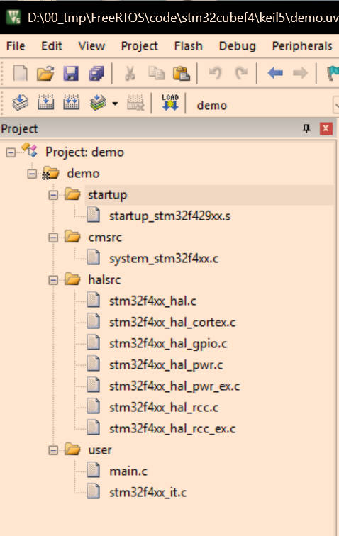

# 说明 

FreeRTOS学习笔记 


# 搭建STM32F1开发环境 

- arm-none-eabi-gcc 下载：https://developer.arm.com/tools-and-software/open-source-software/developer-tools/gnu-toolchain/gnu-rm/downloads 
- GitHub上ST官方库：https://github.com/STMicroelectronics/STM32CubeF1

由于`github`仓库使用`git submodule`命令创建的，不能直接下载`zip`压缩包，需要使用`git`指令下载：

```shell
git clone --recursive https://github.com/STMicroelectronics/STM32CubeF1.git
git pull
git submodule update --init --recursive
```


# 搭建STM32F4开发环境 

- GitHub上ST官方库：https://github.com/STMicroelectronics/STM32CubeF4

由于`github`仓库使用`git submodule`命令创建的，不能直接下载`zip`压缩包，需要使用`git`指令下载：

```C
git clone --recursive https://github.com/STMicroelectronics/STM32CubeF4.git
git pull
git submodule update --init --recursive
```


# keil5搭建STM32F4HAL库开发环境 


- GitHub上ST官方库：https://github.com/STMicroelectronics/STM32CubeF4

由于`github`仓库使用`git submodule`命令创建的，不能直接下载`zip`压缩包，需要使用`git`指令下载：

```shell
git clone --recursive https://github.com/STMicroelectronics/STM32CubeF4.git
git pull
git submodule update --init --recursive
```

硬件开发环境：

- 正点原子`STM32F429IGT6`开发板
- `keil5` 

`STM32F429IGT6`系列`MCU`：

- 内核：ARM Cortex-M4
- 架构：ARMv7-M
- 支持：Thumb-2指令集、单精度FPU，DSP指令
- Flash：1M
- RAM：256K（192K+64K CCM）

创建文件夹

- cminc：存放`STM32CubeF4\Drivers\CMSIS\Include` 路劲下的头文件，只需要4个头文件：`cmsis_armclang.h`，`cmsis_compiler.h`，`cmsis_version.h`，`core_cm4.h`，`mpu_armv7.h`，`cmsis_armcc.h`

    

  

​	注意`keil5`中使用**版本5**编译器会调用`cmsis_armcc.h` 头文件，使用**版本6**编译器会调用`cmsis_armclang.h`头文件，所以最好两个文件都包含

 

- halsrc：存放`STM32CubeF4\Drivers\STM32F4xx_HAL_Driver\Src` 下面的库文件
- halinc：存放`STM32CubeF4\Drivers\STM32F4xx_HAL_Driver\Inc` 下面的头文件
- cmsrc：存放`STM32CubeF4\Drivers\CMSIS\Device\ST\STM32F4xx\Source\Templates\` 路径下的`system_stm32f4xx.c` 文件
- startup：存放`STM32CubeF4\Drivers\CMSIS\Device\ST\STM32F4xx\Source\Templates\arm` 下面的启动文件，选择`startup_stm32f429xx.s` 启动文件

- config：

  - 存放 `STM32CubeF4\Drivers\CMSIS\Device\ST\STM32F4xx\Include\` 路径下的`system_stm32f4xx.h` ，`stm32f4xx.h` ，`stm32f429xx.h` 文件。
  - 存放`STM32CubeF4\Projects\STM32F429I-Discovery\Templates\Inc\` 路径下的`stm32f4xx_hal_conf.h`，`stm32f4xx_it.h` ，`main.h`文件

- user：存放`STM32CubeF4\Projects\STM32F429I-Discovery\Templates\Src\` 路径下的 `main.c` ，`stm32f4xx_it.c` 文件

  

至此，所需文件全部找到，使用keil5开始添加文件

新建一个keil5工程

 

 

创建完成之后的空项目如下图：

 

添加相应文件：

 

添加相应头文件：

 

添加宏定义：

```c
USE_HAL_DRIVER,STM32F429xx
```

 

修改晶振频率，开发板使用的25M晶振，默认是8M，需要修改，否则串口输出会乱码。找到 `stm32f4xx_hal_conf.h` 文件，修改`#define HSE_VALUE    (25000000U)` 

 

编译程序

## 测试程序 

### 修改时钟频率 

最大为180M，主要修改时钟分频系数

```C
static void SystemClock_Config(void)
{
  RCC_ClkInitTypeDef RCC_ClkInitStruct;
  RCC_OscInitTypeDef RCC_OscInitStruct;

  /* Enable Power Control clock */
  __HAL_RCC_PWR_CLK_ENABLE();
  
  /* The voltage scaling allows optimizing the power consumption when the device is 
     clocked below the maximum system frequency, to update the voltage scaling value 
     regarding system frequency refer to product datasheet.  */
  __HAL_PWR_VOLTAGESCALING_CONFIG(PWR_REGULATOR_VOLTAGE_SCALE1);
  
  /* Enable HSE Oscillator and activate PLL with HSE as source */
  RCC_OscInitStruct.OscillatorType = RCC_OSCILLATORTYPE_HSE;
  RCC_OscInitStruct.HSEState = RCC_HSE_ON;
  RCC_OscInitStruct.PLL.PLLState = RCC_PLL_ON;
  RCC_OscInitStruct.PLL.PLLSource = RCC_PLLSOURCE_HSE;
  RCC_OscInitStruct.PLL.PLLM = 25;
  RCC_OscInitStruct.PLL.PLLN = 360;
  RCC_OscInitStruct.PLL.PLLP = RCC_PLLP_DIV2;
  RCC_OscInitStruct.PLL.PLLQ = 8;
  if(HAL_RCC_OscConfig(&RCC_OscInitStruct) != HAL_OK)
  {
    /* Initialization Error */
    Error_Handler();
  }
  
  if(HAL_PWREx_EnableOverDrive() != HAL_OK)
  {
    /* Initialization Error */
    Error_Handler();
  }
  
  /* Select PLL as system clock source and configure the HCLK, PCLK1 and PCLK2 
     clocks dividers */
  RCC_ClkInitStruct.ClockType = (RCC_CLOCKTYPE_SYSCLK | RCC_CLOCKTYPE_HCLK | RCC_CLOCKTYPE_PCLK1 | RCC_CLOCKTYPE_PCLK2);
  RCC_ClkInitStruct.SYSCLKSource = RCC_SYSCLKSOURCE_PLLCLK;
  RCC_ClkInitStruct.AHBCLKDivider = RCC_SYSCLK_DIV1;
  RCC_ClkInitStruct.APB1CLKDivider = RCC_HCLK_DIV4;  
  RCC_ClkInitStruct.APB2CLKDivider = RCC_HCLK_DIV2;  
  if(HAL_RCC_ClockConfig(&RCC_ClkInitStruct, FLASH_LATENCY_5) != HAL_OK)
  {
    /* Initialization Error */
    Error_Handler();
  }
}
```

### 添加LED 

`led.c`文件程序

```C
#include "led.h"

void LED_Init(void)
{
    GPIO_InitTypeDef GPIO_Initure;
    __HAL_RCC_GPIOB_CLK_ENABLE();           
	
    GPIO_Initure.Pin=GPIO_PIN_0|GPIO_PIN_1; 
    GPIO_Initure.Mode=GPIO_MODE_OUTPUT_PP;  
    GPIO_Initure.Pull=GPIO_PULLUP;         
    GPIO_Initure.Speed=GPIO_SPEED_HIGH;     
    HAL_GPIO_Init(GPIOB,&GPIO_Initure);
	
    HAL_GPIO_WritePin(GPIOB,GPIO_PIN_0,GPIO_PIN_SET);	
    HAL_GPIO_WritePin(GPIOB,GPIO_PIN_1,GPIO_PIN_SET);	
}
```

`led.h`文件程序：

```C
#ifndef __LED_H__
#define __LED_H__
#include "main.h"
void LED_Init(void);
#endif
```


### 添加串口 

uart.c文件程序：

```C
#include "uart.h"

#include <stdio.h>
UART_HandleTypeDef UART1_Handler; 

void uart_init(uint32_t bound)
{	

	UART1_Handler.Instance=USART1;					    
	UART1_Handler.Init.BaudRate=bound;				    
	UART1_Handler.Init.WordLength=UART_WORDLENGTH_8B;   
	UART1_Handler.Init.StopBits=UART_STOPBITS_1;	    
	UART1_Handler.Init.Parity=UART_PARITY_NONE;		    
	UART1_Handler.Init.HwFlowCtl=UART_HWCONTROL_NONE;   
	UART1_Handler.Init.Mode=UART_MODE_TX_RX;		    
	HAL_UART_Init(&UART1_Handler);					    
	

}
void HAL_UART_MspInit(UART_HandleTypeDef *huart)
{
   
	GPIO_InitTypeDef GPIO_Initure;
	
	if(huart->Instance==USART1)
	{
		__HAL_RCC_GPIOA_CLK_ENABLE();			
		__HAL_RCC_USART1_CLK_ENABLE();			
	
		GPIO_Initure.Pin=GPIO_PIN_9;			
		GPIO_Initure.Mode=GPIO_MODE_AF_PP;		
		GPIO_Initure.Pull=GPIO_PULLUP;			
		GPIO_Initure.Speed=GPIO_SPEED_FAST;		
		GPIO_Initure.Alternate=GPIO_AF7_USART1;	
		HAL_GPIO_Init(GPIOA,&GPIO_Initure);	   	

		GPIO_Initure.Pin=GPIO_PIN_10;			
		HAL_GPIO_Init(GPIOA,&GPIO_Initure);	   	
		__HAL_UART_DISABLE_IT(huart,UART_IT_TC);
#if EN_USART1_RX
		__HAL_UART_ENABLE_IT(huart,UART_IT_RXNE);		
		HAL_NVIC_EnableIRQ(USART1_IRQn);				
		HAL_NVIC_SetPriority(USART1_IRQn,3,3);			
#endif	
	}

}

//重定义fputc函数 
int fputc(int ch, FILE *f)
{ 	
	while((USART1->SR&0X40)==0);//循环发送,直到发送完毕   
	USART1->DR = (uint8_t) ch;      
	return ch;
}
```

uart.h文件程序：

```C
#ifndef __UART_H__
#define __UART_H__
#include "main.h"
void uart_init(uint32_t bound);
#endif
```

### 添加文件之后完整工程 

 

### main函数测试 

```C
/**
  ******************************************************************************
  * @file    Templates/Src/main.c 
  * @author  MCD Application Team
  * @brief   Main program body
  ******************************************************************************
  * @attention
  *
  * Copyright (c) 2017 STMicroelectronics.
  * All rights reserved.
  *
  * This software is licensed under terms that can be found in the LICENSE file
  * in the root directory of this software component.
  * If no LICENSE file comes with this software, it is provided AS-IS.
  *
  ******************************************************************************
  */

/* Includes ------------------------------------------------------------------*/
#include "main.h"

#include "led.h"
#include "uart.h"
#include <stdio.h>
/** @addtogroup STM32F4xx_HAL_Examples
  * @{
  */

/** @addtogroup Templates
  * @{
  */

/* Private typedef -----------------------------------------------------------*/
/* Private define ------------------------------------------------------------*/
/* Private macro -------------------------------------------------------------*/
/* Private variables ---------------------------------------------------------*/
/* Private function prototypes -----------------------------------------------*/
static void SystemClock_Config(void);
static void Error_Handler(void);

/* Private functions ---------------------------------------------------------*/

/**
  * @brief  Main program
  * @param  None
  * @retval None
  */
int main(void)
{

  /* STM32F4xx HAL library initialization:
       - Configure the Flash prefetch, Flash preread and Buffer caches
       - Systick timer is configured by default as source of time base, but user 
             can eventually implement his proper time base source (a general purpose 
             timer for example or other time source), keeping in mind that Time base 
             duration should be kept 1ms since PPP_TIMEOUT_VALUEs are defined and 
             handled in milliseconds basis.
       - Low Level Initialization
     */
  HAL_Init();

  /* Configure the System clock to 180 MHz */
  SystemClock_Config();


  /* Add your application code here
     */

	LED_Init();
	uart_init(115200);
	
	printf("Hello World!\r\n");
  /* Infinite loop */
  while (1)
  {
		HAL_GPIO_WritePin(GPIOB,GPIO_PIN_1,GPIO_PIN_RESET); 
		HAL_GPIO_WritePin(GPIOB,GPIO_PIN_0,GPIO_PIN_SET);   
		HAL_Delay(500);										
		HAL_GPIO_WritePin(GPIOB,GPIO_PIN_1,GPIO_PIN_SET);   
		HAL_GPIO_WritePin(GPIOB,GPIO_PIN_0,GPIO_PIN_RESET); 
		HAL_Delay(500);
	  
  }
}

/**
  * @brief  System Clock Configuration
  *         The system Clock is configured as follow : 
  *            System Clock source            = PLL (HSE)
  *            SYSCLK(Hz)                     = 180000000
  *            HCLK(Hz)                       = 180000000
  *            AHB Prescaler                  = 1
  *            APB1 Prescaler                 = 4
  *            APB2 Prescaler                 = 2
  *            HSE Frequency(Hz)              = 8000000
  *            PLL_M                          = 8
  *            PLL_N                          = 360
  *            PLL_P                          = 2
  *            PLL_Q                          = 7
  *            VDD(V)                         = 3.3
  *            Main regulator output voltage  = Scale1 mode
  *            Flash Latency(WS)              = 5
  * @param  None
  * @retval None
  */
static void SystemClock_Config(void)
{
  RCC_ClkInitTypeDef RCC_ClkInitStruct;
  RCC_OscInitTypeDef RCC_OscInitStruct;

  /* Enable Power Control clock */
  __HAL_RCC_PWR_CLK_ENABLE();
  
  /* The voltage scaling allows optimizing the power consumption when the device is 
     clocked below the maximum system frequency, to update the voltage scaling value 
     regarding system frequency refer to product datasheet.  */
  __HAL_PWR_VOLTAGESCALING_CONFIG(PWR_REGULATOR_VOLTAGE_SCALE1);
  
  /* Enable HSE Oscillator and activate PLL with HSE as source */
  RCC_OscInitStruct.OscillatorType = RCC_OSCILLATORTYPE_HSE;
  RCC_OscInitStruct.HSEState = RCC_HSE_ON;
  RCC_OscInitStruct.PLL.PLLState = RCC_PLL_ON;
  RCC_OscInitStruct.PLL.PLLSource = RCC_PLLSOURCE_HSE;
  RCC_OscInitStruct.PLL.PLLM = 25;
  RCC_OscInitStruct.PLL.PLLN = 360;
  RCC_OscInitStruct.PLL.PLLP = RCC_PLLP_DIV2;
  RCC_OscInitStruct.PLL.PLLQ = 8;
  if(HAL_RCC_OscConfig(&RCC_OscInitStruct) != HAL_OK)
  {
    /* Initialization Error */
    Error_Handler();
  }
  
  if(HAL_PWREx_EnableOverDrive() != HAL_OK)
  {
    /* Initialization Error */
    Error_Handler();
  }
  
  /* Select PLL as system clock source and configure the HCLK, PCLK1 and PCLK2 
     clocks dividers */
  RCC_ClkInitStruct.ClockType = (RCC_CLOCKTYPE_SYSCLK | RCC_CLOCKTYPE_HCLK | RCC_CLOCKTYPE_PCLK1 | RCC_CLOCKTYPE_PCLK2);
  RCC_ClkInitStruct.SYSCLKSource = RCC_SYSCLKSOURCE_PLLCLK;
  RCC_ClkInitStruct.AHBCLKDivider = RCC_SYSCLK_DIV1;
  RCC_ClkInitStruct.APB1CLKDivider = RCC_HCLK_DIV4;  
  RCC_ClkInitStruct.APB2CLKDivider = RCC_HCLK_DIV2;  
  if(HAL_RCC_ClockConfig(&RCC_ClkInitStruct, FLASH_LATENCY_5) != HAL_OK)
  {
    /* Initialization Error */
    Error_Handler();
  }
}

/**
  * @brief  This function is executed in case of error occurrence.
  * @param  None
  * @retval None
  */
static void Error_Handler(void)
{
  /* User may add here some code to deal with this error */
  while(1)
  {
  }
}

#ifdef  USE_FULL_ASSERT
/**
  * @brief  Reports the name of the source file and the source line number
  *         where the assert_param error has occurred.
  * @param  file: pointer to the source file name
  * @param  line: assert_param error line source number
  * @retval None
  */
void assert_failed(uint8_t* file, uint32_t line)
{ 
  /* User can add his own implementation to report the file name and line number,
     ex: printf("Wrong parameters value: file %s on line %d\r\n", file, line) */

  /* Infinite loop */
  while (1)
  {
  }
}
#endif

/**
  * @}
  */ 

/**
  * @}
  */
```

可以看见LED闪烁，串口打印输出。


# 移植FreeRTOS 

在上一个HAL库基础上添加FreeRTOS操作系统，由于FreeRTOS使用了滴答时钟，默认HAL库也使用了滴答时钟，需要将原来HAL库换成定时器方式


